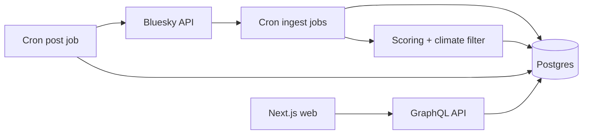

# AGENTS.md

This document gives AI agents and contributors a practical overview of the current system design and database schema for this repository.

## Scope

- Workspace root: services
- Backend: Rust services in news_service/components
- Frontend: Next.js app in web
- Infra: Docker Compose, Terraform, Ansible in devops

## System Design

### High-level components

1. Cron service (Rust, Actix)
   - Path: news_service/components/cron
   - Runs scheduled jobs for:
     - Bluesky ingestion (fetch accounts/posts/URLs)
     - URL scoring and climate classification
     - Posting selected links back to Bluesky
   - Exposes /health for health checks.

2. API service (Rust, Actix + async-graphql)
   - Path: news_service/components/api
   - Serves GraphQL endpoints for the web app.
   - Exposes /graphql, /playground, and /health.

3. DB component (Rust + SQLx)
   - Path: news_service/components/db
   - Owns SQL migrations, models, and query modules.
   - Shared by cron and API.

4. Web service (Next.js)
   - Path: web
   - Builds a fully static export (`next build && next export`) that queries the API at build time.
   - Pages use `getStaticProps` (index, articles) and `getStaticPaths` (articles, fed by the `newsFeedUrlSlugs` query).
   - Sitemaps are generated at build time by web/scripts/generate-sitemaps.mjs into web/public.
   - Publishes to Cloudflare Pages via devops/scripts/static-build-and-publish.sh (see devops/README.md).

5. Postgres
   - Provisioned via docker-compose.yaml for local dev.
   - Stores ingestion data, references, feed ranking, and cron run state.

### Runtime data flow

### Scheduling model

- The cron binary starts two scheduler loops:
  - main scheduler: ingestion + feed population
  - post scheduler: publish selected article URLs to Bluesky
- Scheduler code is under news_service/components/cron/src/scheduler.

## Database Schema (Current)

Authoritative schema lives in SQL migrations under news_service/components/db/migrations.

### Core Bluesky ingestion tables

1. news_bsky_user
   - Source migration: 3_news_bsky_user.up.sql
   - Primary key: did
   - Stores profile + scoring fields:
     - handle, display_name, avatar_url, description
     - followers_count, follows_count, posts_count, user_score
     - last_post_cid, last_updated_at, last_checked_at

2. news_bsky_post
   - Source migration: 4_news_bsky_post.up.sql
   - Primary key: post_uri
   - Foreign key: author_did -> news_bsky_user.did
   - Stores text/content identifiers and thread context:
     - cid, text, reply_parent_uri, reply_root_uri, created_at
   - Indexes:
     - idx_bsky_post_author(author_did)
     - idx_bsky_post_created(created_at)

3. news_bsky_reference
   - Source migration: 5_news_bsky_reference.up.sql
   - Composite primary key: (post_uri, ref_post_uri, ref_kind)
   - Foreign key: post_uri -> news_bsky_post.post_uri
   - Represents edges like repost/reply relationships.

4. news_bsky_post_url
   - Source migration: 6_news_bsky_post_url.up.sql
   - Primary key: url_id (serial)
   - Unique: expanded_url_parsed
   - Stores extracted URL and metadata:
     - host, title, description, preview images, language flags
     - is_bsky_url marks internal Bluesky links vs external article links

5. news_bsky_referenced_post_url
   - Source migration: 7_news_bsky_referenced_post_url.up.sql
   - Composite primary key: (post_uri, url_id)
   - Foreign key: url_id -> news_bsky_post_url.url_id
   - Join table linking posts to extracted URLs.

6. news_bsky_feed_source
   - Source migration: 8_news_bsky_feed_source.up.sql
   - Primary key: source_uri
   - Tracks configured feed/list/actor sources and last_checked_at.

### Shared feed output tables

7. news_feed_url
   - Source migration: 1_news_feed_url.up.sql (+ 19_news_feed_url_updated_at.up.sql adds `updated_at`)
   - Purpose: ranked, deduplicated candidate URLs for publication
   - Key fields:
     - url_slug (unique), url_id (unique)
     - url_score, num_references, first_referenced_by
     - is_climate_related
     - bsky_posted_at, bsky_posted_at_str, updated_at (change cursor for static rebuilds)

8. news_cron_job
   - Source migration: 2_news_cron_job.up.sql
   - Tracks cron execution status:
     - cron_type, started_at, completed_at, error

### Key relationships

- A user creates many posts:
  - news_bsky_user.did -> news_bsky_post.author_did
- A post can reference many other posts:
  - news_bsky_post.post_uri -> news_bsky_reference.post_uri
- A post can contain many URLs (many-to-many):
  - news_bsky_post.post_uri <-> news_bsky_referenced_post_url <-> news_bsky_post_url.url_id
- Ranked feed entries in news_feed_url map to extracted URLs by url_id.

### Notes on legacy tables

- The active design is Bluesky-only for ingestion and publishing.
- Legacy Twitter/X migrations were removed entirely (never created).

## Practical File Map

- Schema migrations:
  - news_service/components/db/migrations
- Rust data models:
  - news_service/components/db/src/models
- SQL query modules:
  - news_service/components/db/src/sql
- Cron orchestration:
  - news_service/components/cron/src/scheduler
- Bluesky client + parsing:
  - news_service/components/cron/src/bluesky
- GraphQL API:
  - news_service/components/api/src/graphql
- Web GraphQL queries + UI:
  - web/graphql and web/components
- Build-time sitemap generation:
  - web/scripts/generate-sitemaps.mjs (run via `prebuild` before `next build`)
- Static site publish:
  - devops/scripts/static-build-and-publish.sh + devops/systemd/climatenews-static-publish.{service,timer}
- Build metadata (change cursor for the static site):
  - newsFeedBuildMetadata query → news_feed_url.updated_at
